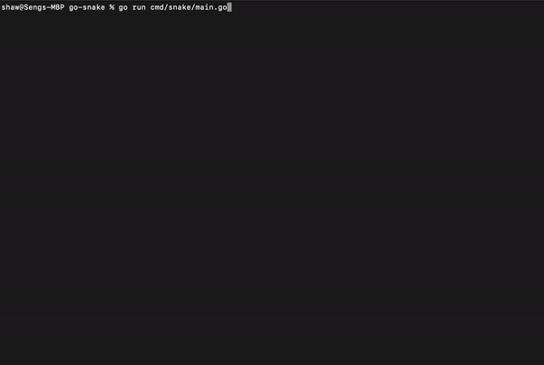

# Go-Snake

Go implementation of the Snake game. Fully in-terminal.

To run the program, you can clone the repository and run it. See the following guide on how to do it.

## Run with source code

1. Make sure you have Go installed on your machine. ([See how](https://golang.org/doc/install))
2. Clone this repository.
3. Run `go run .` in the project directory.

## Motivation

I started this project because I want to learn about Go. I had several project ideas but in the end I chose to build a simple console game that I can realistically finish in a short amount of time.

## Process

The project took me a weekend to finish. Not only did I learn a lot about Goroutines, but I also learned a lot about [ANSI escape sequences](https://en.wikipedia.org/wiki/ANSI_escape_code), which is heavily used in the printing operations.
